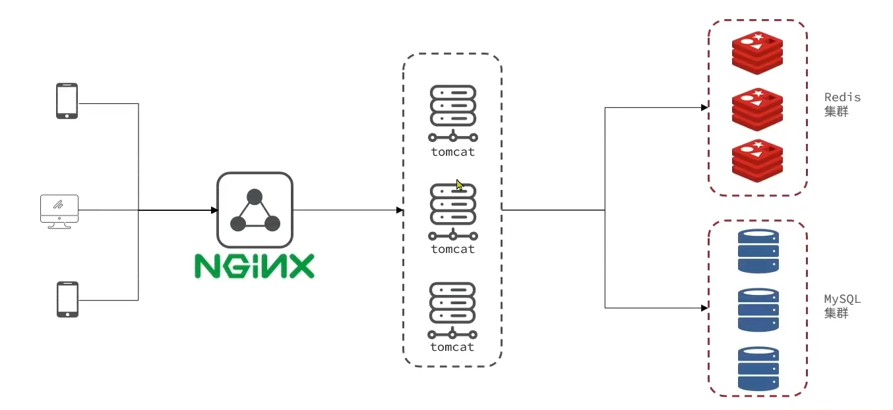

# Heima Redis Practice Project

## Introduction
This is a practice project focused on Redis integration. 
Some parts of the project are provided by the Heima internet course. 
I implemented several common and important usages of Redis.

## Architecture

## Features that are implemented by myself:
### User login / Shared session
#### Introduction
- User can choose fast log in with phone number, 
server will send a code (implemented by printing on the server console log) for verification.
- After user are verified, the server will generate a token and store it in Redis.
#### Selling Points
- I didn't use the spring session because this is a practice project.
- Scalable
  - The verification code and user session are stored in Redis, so the server is horizontally scalable.
- Extendable session
  - The session will be extended by user continuously interacting with the server.

### Caching shop APIs:
#### Introduction
- User's shop query API results are cached in Redis, speeding up the response time.
- When the shop data is updated, the cache is invalidated.
#### Selling Points
- "Cache Penetration" protection
  - The invalid or doesn't exist shop data will also be cached (in empty string) in a short time.
- Proactive cache invalidation
  - When the shop data is updated, the cache is invalidated.
  - The cache rebuilding is depending on the "Repair on Read" strategy. 